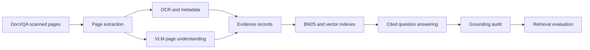

# CaseLens-VLM

**Enterprise multimodal document intelligence with VLMs, hybrid retrieval, citations, and audit controls.**

CaseLens-VLM is a portfolio-grade multimodal RAG pipeline over real scanned DocVQA pages. It uses open vision-language models to turn page images into searchable evidence, retrieves cited pages for questions, evaluates retrieval quality, and maps the same pattern to an enterprise AWS reference architecture.

I built this around a practical question: when documents are scanned pages, forms, tables, handwriting, and layout-heavy reports, how much does visual page understanding improve retrieval compared with metadata alone?

## Highlights

| Capability | What is implemented |
| --- | --- |
| Real data | DocVQA scanned document pages from the UCSF Industry Documents Library |
| VLM evidence | Qwen2.5-VL and Qwen3-VL page-level visual summaries |
| Retrieval | BM25 baseline plus MiniLM dense hybrid retrieval |
| Evaluation | Same 100-page / 339-question subset across all retrieval modes |
| Governance | Local citation audit, grounding checks, reviewer-oriented UI, AWS guardrail mapping |
| Infrastructure | Isambard GH200 GPU batch workflow with reproducible Slurm scripts |

## Problem

Most enterprise RAG demos assume clean extracted text. Real document estates are messier: scanned pages, forms, charts, tables, signatures, handwriting, and visual layout cues. CaseLens-VLM shows how to convert those pages into retrievable evidence while preserving page-level provenance.

## What This Does

- Runs VLM inference over document page images
- Builds page-level evidence records with provenance
- Indexes VLM evidence with lexical and hybrid retrieval
- Answers questions with cited source pages
- Evaluates retrieval with real DocVQA question-to-page labels
- Provides audit, guardrail, and AWS reference-architecture material

## Dataset

The main dataset is **DocVQA**, a document visual question answering benchmark built from real document pages from the UCSF Industry Documents Library. Raw dataset files are not committed to this repository.

Useful references:

- DocVQA dataset: https://site.docvqa.org/datasets/docvqa
- Qwen2.5-VL model family: https://huggingface.co/Qwen/Qwen2.5-VL-7B-Instruct
- Qwen3-VL model family: https://huggingface.co/Qwen/Qwen3-VL-8B-Instruct

## Architecture



The publishable enterprise version is documented in [`docs/reference_architecture.md`](docs/reference_architecture.md).

## Isambard Quickstart

The project assumes DocVQA has already been downloaded to:

```bash
$SCRATCH/vlm_doc_project/docvqa_hf
```

Prepare a 500-question sample:

```bash
cd "$SCRATCH/vlm_doc_project/caselens-vlm"
source "$HOME/miniforge3/etc/profile.d/conda.sh"
conda activate vlm-doc

pip install -r requirements.txt

python scripts/prepare_docvqa.py \
  --dataset "$SCRATCH/vlm_doc_project/docvqa_hf" \
  --out data/docvqa_sample \
  --split validation \
  --limit 500
```

Run the demo retrieval baseline:

```bash
python scripts/build_index.py \
  --records data/docvqa_sample/page_records.jsonl \
  --out data/docvqa_sample/index_demo.json \
  --include-gold-questions

python scripts/evaluate_retrieval.py \
  --index data/docvqa_sample/index_demo.json \
  --records data/docvqa_sample/page_records.jsonl \
  --qas data/docvqa_sample/qa_records.jsonl \
  --k 5 \
  --out data/docvqa_sample/eval_demo.json
```

Generate VLM page summaries:

```bash
# Install a GPU-compatible PyTorch build first, then:
pip install -r requirements-vlm.txt

python scripts/generate_vlm_summaries.py \
  --records data/docvqa_sample/page_records.jsonl \
  --image-root data/docvqa_sample \
  --out data/docvqa_sample/vlm_page_summaries.jsonl \
  --model Qwen/Qwen2.5-VL-3B-Instruct \
  --backend auto \
  --limit 100 \
  --resume
```

To compare a stronger challenger model on the same pages, use:

```bash
python scripts/generate_vlm_summaries.py \
  --records data/docvqa_sample/page_records.jsonl \
  --image-root data/docvqa_sample \
  --out data/docvqa_sample/vlm_qwen3_8b_100.jsonl \
  --model Qwen/Qwen3-VL-8B-Instruct \
  --backend qwen3 \
  --limit 100 \
  --resume
```

On shared clusters, use `--local-files-only` with a cached model snapshot to avoid Hugging Face rate limits.

Build a strict VLM-summary index:

```bash
python scripts/build_index.py \
  --records data/docvqa_sample/vlm_page_summaries.jsonl \
  --out data/docvqa_sample/index_vlm.json \
  --text-field vlm_summary

python scripts/ask.py \
  --index data/docvqa_sample/index_vlm.json \
  --records data/docvqa_sample/vlm_page_summaries.jsonl \
  --question "Which page contains the coffee break time?" \
  --k 3
```

## Current Verified Results

The project now has real Qwen2.5-VL and Qwen3-VL results over the same DocVQA page subset. Full details are in `docs/results.md`.

| Sample | Pages | Questions | Mode | Recall@1 | Recall@5 |
| --- | ---: | ---: | --- | ---: | ---: |
| Qwen3-VL real run | 100 | 339 | hybrid BM25 + MiniLM embeddings | not measured | 0.708 |
| Qwen3-VL real run | 100 | 339 | strict VLM-summary retrieval | 0.445 | 0.658 |
| Qwen2.5-VL real run | 100 | 339 | hybrid BM25 + MiniLM embeddings | not measured | 0.587 |
| Qwen2.5-VL real run | 100 | 339 | strict VLM-summary retrieval | 0.363 | 0.534 |
| Same subset | 100 | 339 | metadata-only retrieval | 0.003 | 0.035 |
| Same subset | 100 | 339 | demo gold-question retrieval | 0.923 | 0.988 |
| Smoke | 29 | 100 | demo gold-question retrieval | not measured | 1.000 |
| Main | 138 | 500 | demo gold-question retrieval | not measured | 0.978 |

The Qwen2.5-VL-3B 100-page inference run completed in 24m47s. The Qwen3-VL-8B challenger run completed in 30m42s using a capped visual token budget. Both used an NVIDIA GH200 GPU node through the public Isambard container `/lus/lfs1aip2/projects/public/u6ei/torch_cuda126.sif`. Hybrid rows add a lightweight dense retrieval pass using `sentence-transformers/all-MiniLM-L6-v2` over the same VLM summaries.

On Isambard, verify the PyTorch build before VLM inference:

```bash
python - << 'EOF'
import torch
print(torch.__version__)
print("cuda_available:", torch.cuda.is_available())
print("torch_cuda:", torch.version.cuda)
EOF
```

## CLI Reference

```bash
python scripts/prepare_docvqa.py --dataset PATH --out DIR --split validation --limit 500
python scripts/generate_vlm_summaries.py --records page_records.jsonl --image-root DIR --out vlm_page_summaries.jsonl
python scripts/build_index.py --records RECORDS --out index.json --text-field metadata|vlm_summary
python scripts/ask.py --index index.json --records RECORDS --question "..." --k 5
python scripts/evaluate_retrieval.py --index index.json --records RECORDS --qas qa_records.jsonl --k 5
python scripts/audit_run.py --index index.json --records RECORDS --question "..." --answer "..." --out audit.jsonl
```

## Streamlit Demo

The app has two modes:

- **Public demo mode:** works on Streamlit Community Cloud without raw DocVQA images or generated artifacts, and accepts uploaded document images as demo evidence.
- **Local artifact mode:** shows retrieved page images when the Isambard-generated DocVQA files are available.

Launch locally:

```bash
streamlit run app.py
```

The app shows verified benchmark metrics, a live retrieval demo with image upload, an enterprise architecture view, and an optional local viewer for generated records. See `docs/streamlit_deploy.md` for deployment notes.

## Repository Policy

This repo intentionally excludes:

- Raw DocVQA images and saved datasets
- Generated indexes and JSONL outputs
- Model weights and Hugging Face caches
- Slurm logs

See `docs/aws_architecture.md` for the AWS implementation mapping and `docs/cv_project_summary.md` for a concise portfolio summary.
See `docs/results.md` for real Qwen2.5-VL and Qwen3-VL retrieval metrics.
See `docs/linkedin_post.md` and `docs/interview_talking_points.md` for company-facing materials.
See `docs/enterprise_architecture.md` for the guardrails, audit, and monitoring design.
See `docs/reference_architecture.md` for a publishable enterprise AWS reference architecture.

## Limitations

- The demo baseline uses DocVQA question text and is only a pipeline sanity check.
- The strict VLM path depends on downloading and running a VLM such as Qwen2.5-VL-3B.
- PyTorch/CUDA installation is cluster-specific; use a build compatible with the active NVIDIA driver.
- Official DocVQA OCR transcriptions are not bundled in the Hugging Face mirror used here.
