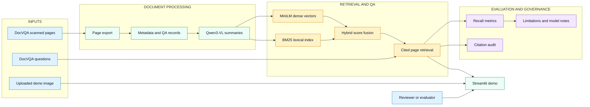
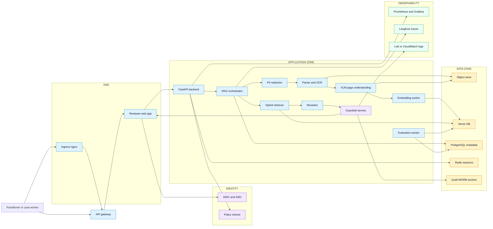
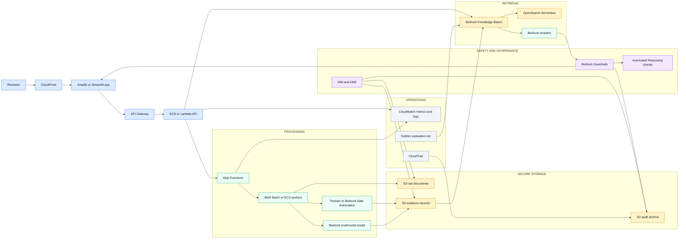

# Architecture Blueprints

These diagrams are designed for recruiters, interviewers, and LinkedIn readers. They show the same idea at three levels: the implemented open-source project, a DialogXR-style enterprise deployment, and an AWS managed-service deployment.

## 1. Open-Source CaseLens Topology

This is the architecture implemented in this repository.

**How to explain it:** CaseLens turns scanned pages into evidence records, uses VLMs to describe visual content, retrieves cited pages, and evaluates whether retrieval improves over metadata-only search.

## 2. DialogXR-Style Enterprise Topology

This version maps the same project pattern to a healthcare/public-sector style platform with trust zones, identity, observability, and human review.

**How to explain it:** This is the version you would propose for DialogXR-like work: secure practitioner access, policy checks, PII handling, VLM-assisted evidence extraction, hybrid retrieval, guardrails, immutable audit, and monitoring.

## 3. AWS Managed-Service Topology

This version maps the pipeline to AWS services that are relevant to GenAI and the AWS AI Practitioner / GenAI certification story.

**How to explain it:** This is the managed version: S3 for documents, Textract or Bedrock Data Automation for extraction, Bedrock multimodal models for visual evidence, Bedrock Knowledge Bases and OpenSearch for retrieval, Bedrock Guardrails for grounding and policy checks, and CloudWatch/CloudTrail/S3 for observability and audit.

## Design Decisions to Defend

| Decision | Why it matters |
| --- | --- |
| Page-level evidence records | Keeps citations stable and reviewable |
| Hybrid retrieval | Combines exact lexical matches with semantic similarity |
| Human-in-the-loop review | Avoids autonomous decisions in sensitive workflows |
| Guardrails after retrieval | Checks generated answers against retrieved evidence |
| Immutable audit archive | Supports compliance, incident review, and model governance |
| Golden evaluation set | Prevents model or prompt changes from silently degrading retrieval |

## Sources

- Amazon Bedrock multimodal Knowledge Bases: https://docs.aws.amazon.com/bedrock/latest/userguide/kb-multimodal.html
- Amazon Bedrock Guardrails contextual grounding: https://docs.aws.amazon.com/bedrock/latest/userguide/guardrails-contextual-grounding-check.html
- Amazon Bedrock Automated Reasoning checks: https://docs.aws.amazon.com/bedrock/latest/userguide/guardrails-automated-reasoning-checks.html
- Amazon Bedrock reranking: https://docs.aws.amazon.com/en_us/bedrock/latest/userguide/rerank-use.html
