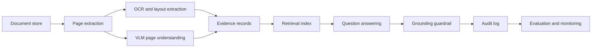

# Enterprise Architecture

CaseLens-VLM is not deployed as a production AWS system. This document shows how the working Isambard pipeline maps to an enterprise document AI design.

## Pipeline

## Runtime Responsibilities

| Layer | Responsibility |
| --- | --- |
| Ingestion | Store PDFs/images, split pages, preserve source IDs |
| Extraction | Generate OCR, layout, and VLM summaries |
| Indexing | Build searchable evidence records with page-level provenance |
| Retrieval | Return candidate pages and retrieval scores |
| Guardrails | Check that answers cite retrieved evidence |
| Audit | Log query, retrieved pages, answer, warnings, and model metadata |
| Evaluation | Track Recall@k and citation coverage over benchmark questions |

## AWS Mapping

| CaseLens layer | AWS service pattern |
| --- | --- |
| Document store | Amazon S3 |
| OCR/layout | Amazon Textract or Bedrock Data Automation |
| VLM summaries | Amazon Bedrock multimodal model |
| Retrieval | OpenSearch Serverless or Aurora PostgreSQL with pgvector |
| Orchestration | Step Functions, AWS Batch, or ECS |
| Guardrails | Bedrock Guardrails contextual grounding and automated reasoning checks |
| Audit and monitoring | CloudWatch Logs, CloudWatch metrics, S3 audit archive |

For a fuller publishable design, including IAM, KMS, reranking, human review, and operational metrics, see `docs/reference_architecture.md`.

## Guardrail Design

The local project implements a lightweight grounding audit: an answer is flagged when it does not cite retrieved pages. In a managed AWS version, the same intent maps to Bedrock Guardrails contextual grounding checks and policy-specific validation.

This is deliberately framed as evidence review rather than autonomous decision-making. The system retrieves and cites document pages; a human reviewer remains responsible for final judgment.
