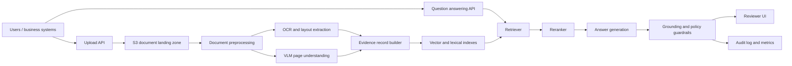

# Enterprise Reference Architecture

This is the production version of the pattern tested in CaseLens-VLM: convert visually rich documents into cited evidence, retrieve the right pages, generate an answer, and keep enough audit detail for a reviewer to trust or challenge the result.

## Architecture

## AWS Service Mapping

| Layer | AWS service pattern | Purpose |
| --- | --- | --- |
| Document store | Amazon S3 with versioning and KMS | Durable source-of-truth for PDFs, images, derived pages, and audit artifacts |
| Preprocessing | AWS Batch or ECS on Fargate | PDF-to-image conversion, page normalization, checksum generation |
| OCR/layout | Amazon Textract or Bedrock Data Automation | Extract text, tables, form fields, figures, and page structure |
| VLM understanding | Amazon Bedrock multimodal model or SageMaker endpoint | Generate page-level visual evidence summaries |
| Evidence catalog | S3 + Glue Data Catalog | Store JSON evidence records with document, page, model, and provenance metadata |
| Retrieval | OpenSearch Serverless or Aurora PostgreSQL with pgvector | Hybrid lexical and vector retrieval over page evidence |
| Reranking | Amazon Bedrock reranker where available | Reorder retrieved evidence before generation |
| Answer generation | Amazon Bedrock foundation model | Produce cited answers from retrieved evidence only |
| Guardrails | Bedrock Guardrails contextual grounding, content filters, topic policies, Automated Reasoning checks where policy rules exist | Flag hallucinations, unsafe content, off-policy answers, and unsupported claims |
| Audit and monitoring | CloudWatch, S3 audit archive, CloudTrail | Track requests, citations, guardrail decisions, latency, cost, and reviewer outcomes |

## Data Flow

1. A document lands in S3 with tenant, case, retention, and sensitivity metadata.
2. A Step Functions workflow starts page extraction, OCR/layout extraction, and VLM page understanding.
3. The evidence builder writes one normalized record per page with source IDs, extracted text, visual summary, detected elements, model version, and processing timestamp.
4. The retrieval layer indexes both text and embeddings, keeping page-level provenance.
5. A user question retrieves candidate pages, reranks them, and sends only the selected evidence to the answer model.
6. Guardrails check whether the answer is grounded in the supplied evidence and whether policy-specific rules are satisfied.
7. The reviewer UI shows the answer, cited pages, visual evidence, guardrail status, and a feedback control.
8. Audit events are written to an immutable S3 prefix and summarized in CloudWatch dashboards.

## Guardrails and Auditor

The local repo implements a lightweight grounding audit: answers that do not cite retrieved page IDs are flagged for review. In a managed AWS design, this expands into four checks:

- **Grounding:** verify the answer is supported by retrieved evidence.
- **Relevance:** verify the answer addresses the question rather than drifting to unrelated content.
- **Policy:** validate rule-heavy responses with Automated Reasoning checks when the policy can be formalized.
- **Human review:** route low-confidence, missing-citation, or policy-sensitive answers to a reviewer queue.

The system should be framed as an evidence-review assistant, not an autonomous decision-maker.

## Operational Controls

- Use IAM least privilege between ingestion, processing, retrieval, and audit services.
- Encrypt source documents, generated evidence, indexes, and logs with KMS-managed keys.
- Keep generated evidence tied to exact model name, model version, prompt version, and source checksum.
- Track Recall@k, citation coverage, guardrail failure rate, reviewer override rate, latency, and per-document cost.
- Maintain a golden evaluation set and rerun it when models, prompts, chunking, or embedding models change.

## References

- Amazon Bedrock multimodal Knowledge Bases: https://docs.aws.amazon.com/bedrock/latest/userguide/kb-multimodal.html
- Amazon Bedrock contextual grounding checks: https://docs.aws.amazon.com/bedrock/latest/userguide/guardrails-contextual-grounding-check.html
- Amazon Bedrock Automated Reasoning checks: https://docs.aws.amazon.com/bedrock/latest/userguide/guardrails-automated-reasoning-checks.html
- Amazon Bedrock reranking: https://docs.aws.amazon.com/bedrock/latest/userguide/rerank.html
- Qwen3-VL model card: https://huggingface.co/Qwen/Qwen3-VL-8B-Instruct
